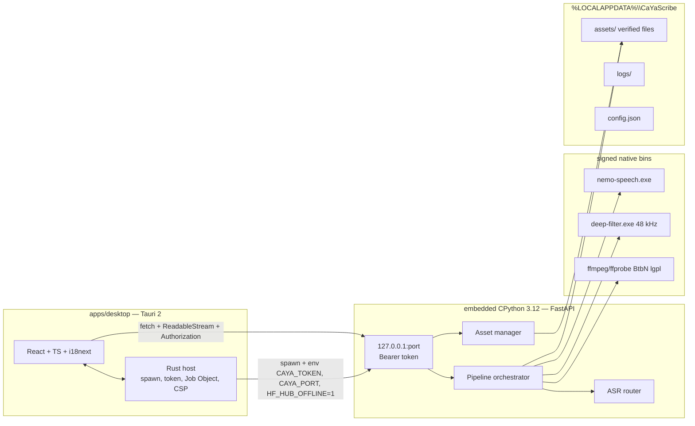
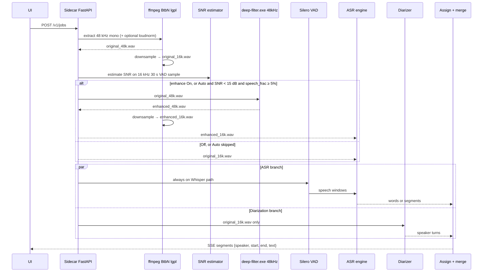

# CaYaScribe — Local Speaker-Aware Multilingual Transcription (Windows Desktop)

| Field | Value |
| --- | --- |
| **Title** | CaYaScribe v1 architecture |
| **Author** | CaYaScribe maintainers |
| **Date** | 2026-09-08 |
| **Status** | Draft (rev 3 — single torch owner, wizard child, deterministic Qwen 1.7B, deep-filter pin) |
| **Audience** | Senior engineers implementing the greenfield repo |
| **Workspace** | `C:\Users\cagan\Desktop\CaYaScribe` (empty as of 2026-09-08; no existing source files) |
| **License (app code)** | MIT |
| **Target OS (v1)** | Windows 10/11 x64 |

---

## Overview

CaYaScribe is a **fully local** Windows desktop app that transcribes audio/video (mp3, mp4, and other common containers) with **speaker labels**, **optional timestamps**, and **inline editing**, then exports `txt` / `srt` / `vtt` / `json`. Audio and video **never leave the machine**. There is no cloud STT. Model and tool downloads happen **only after explicit user consent**, with sizes and checkboxes shown first.

v1 is **not Whisper-only**. A pluggable ASR router selects among:

- **OpenAI Whisper large-v3 family** via `faster-whisper` (CTranslate2) — 99-language coverage and noisy-web robustness.
- **Qwen3-ASR 0.6B / 1.7B** (Apache-2.0) — 30 languages including **first-class Turkish**, trained for noise, singing, and BGM. Recommended high-quality engine for Turkish.
- **NVIDIA Parakeet TDT 0.6B v3** (CC-BY-4.0) — 25 European languages, **not Turkish**. Fast, native word timestamps. Used only when language is in its set.

Speaker diarization is language-agnostic. Speaker count is optional: empty = auto-detect; `1` = skip diarization and label everything `A`; `N ≥ 2` = constrain the diarizer.

The stack is **Tauri 2 + React + TypeScript** in the UI process and an **embedded Python 3.12 sidecar** over loopback HTTP. Progress streams are **SSE consumed with `fetch` + `ReadableStream` and an `Authorization` header** (not `EventSource`). Assets live under `%LOCALAPPDATA%\CaYaScribe\`. After consent downloads, inference is **offline**: `HF_HUB_OFFLINE=1`, filesystem paths only, no `from_pretrained` network fallback. The public GitHub repo will be created after this design; development continues there.

---

## Background & Motivation

Local transcription tools that are actually good on **podcasts, phone calls, cheap mics, and background music** still force a bad choice:

1. **Whisper-only apps** cover 99 languages and survive messy audio (trained on ~680k hours of diverse web data), but English WER is no longer SOTA (~7.44% Open ASR Leaderboard, snapshot 2026-09-08, vs ~5.6% leaders), Turkish is “just another Whisper language,” and hallucinations on silence remain a real product issue.
2. **Specialist 2026 models** beat Whisper on their turf (Qwen3-ASR on Turkish / noisy / singing; Parakeet on 25 EU languages at 6.34% avg WER and RTFx ~3332 on datacenter GPU) but **none of them cover the long tail** (Swahili, Thai beyond Qwen’s 30, heavy African/Asian code-switch, etc.).
3. **Cloud STT** is a non-starter: the product promise is that media never leaves the PC.

The user also needs **speaker-aware** output, **global speaker rename**, and an honest **first-run download dialog**. Silent multi-hundred-MB downloads are a product failure — including Hub/`from_pretrained` and NeMo-Speech.cpp auto-pull defaults.

Current state of the workspace: **empty directory**. This document is the first artifact. No existing files, functions, or patterns to cite from the repo; all paths below are **proposed**.

Pain points this design absorbs up front:

- CUDA DLL hell on Windows consumer GPUs.
- Gated Hugging Face models (pyannote community-1) must not block first launch.
- Parakeet **must not** be selected for Turkish, including after a wrong auto-LID of `en`.
- Over-denoising destroys speaker embeddings; ASR and diarization must see different audio.
- DeepFilterNet3 is a **48 kHz** model; the 16 kHz ASR/diar graph must resample around it.
- Whisper segment timestamps drift; v1 still ships usable timestamps without making WhisperX a monolith.
- ffmpeg “essentials” builds from Gyan are **GPLv3**; decode-only needs a real **LGPL** pin (BtbN `win64-lgpl`).

---

## Goals & Non-Goals

### Goals (v1)

- 100% local inference after assets are on disk. No audio/video upload. No cloud STT. No Hub/NeMo auto-fetch at job time.
- Explicit, checkboxed, sized downloads on first run and from **Ayarlar → Modeller**.
- Transcribe common media via downloaded **BtbN win64-lgpl static ffmpeg** (native LGPL decoders for mp4 / AAC / H.264). No libx264, no `--enable-gpl`.
- Speaker diarization with optional count; labels `A, B, C, …`; one-shot global rename.
- Quality profiles **Hızlı / Dengeli / Yüksek / Maksimum** mapping to real engines and disk/RAM.
- UI locale: Turkish default, English second, i18n-ready.
- Transcription languages: **all Whisper 99**, plus Qwen’s 30 and Parakeet’s 25 via the router. Auto language detect + explicit override. Code-switching must not crash the pipeline.
- Pluggable ASR / diarization / enhancer engines.
- Export from **editor state**: txt, srt, vtt, json; timestamps and speaker labels independently toggleable. Bracket timestamps for **txt** only; SRT/VTT use spec timestamps.
- Project file `.cayascribe.json` referencing media by path + content hash (do not copy huge videos).
- Windows per-user NSIS installer. Models are **not** in git and **not** in the base installer.
- Single-flight jobs. Windows Job Object cancellation.

### Non-Goals (v1)

- macOS / Linux installers (architecture should not preclude them).
- Real-time / streaming microphone transcription as a product feature (engines may support it; UI does not).
- Cloud accounts, collaboration, or telemetry of audio.
- Shipping NVIDIA Canary-Qwen-2.5B, Canary-1B-v2, FunASR SenseVoice, or Distil-Whisper in the v1 installer (plugin slots only).
- Microsoft Word / PDF export.
- Full in-app media player (data model is designed now; playback/seek is a later PR).
- Requiring a Hugging Face token to use the app.
- Bundling CUDA runtime or **GPL** ffmpeg in the base installer.
- Using WhisperX as a monolith (it historically pulls gated pyannote 3.1). We reimplement speaker-to-word assignment.
- Using Sortformer **v1** (CC-BY-NC). v2 is CC-BY-4.0.
- vLLM, flash-attn, `qwen-asr` extras `gradio` / `flask` / `sox`.
- Qwen 1.7B as a CPU path. Qwen without `cu12x`. Torch inside the Qwen or pyannote extras.
- Anonymous error-report toggle (not even an off-by-default Settings row).
- Query-string sidecar tokens or browser `EventSource`.

---

## Key Decisions

These are locked for v1 unless a later RFC changes them.

| ID | Decision | Rationale |
| --- | --- | --- |
| D1 | **UI = Tauri 2 + React 19 + TypeScript + Vite.** Per-user NSIS installer. | Small installer, native WebView2, later macOS/Linux possible. No Electron RAM tax. |
| D2 | **Sidecar = embedded CPython 3.12** (not system Python), **FastAPI on `127.0.0.1:<random>` + bearer token**. Progress is SSE **consumed with `fetch` + `ReadableStream` (or a Tauri proxy) carrying `Authorization`**. Ban `EventSource`. Ban query-string tokens. | HTTP+SSE is easier for long jobs than JSON-RPC stdio. `EventSource` cannot set headers. Token in the query string leaks to logs/Referer. Python 3.12 matches `qwen-asr` guidance. |
| D3 | **Pluggable ASR backends** behind `AsrEngine` with a **deterministic router**. Whisper is the coverage default, not the only engine. | Mid-2026 quality bar is Qwen for Turkish, Parakeet for EU-fast, Whisper for the long tail. |
| D4 | **Whisper runtime = `faster-whisper` (CTranslate2).** GPU `float16` / `int8_float16`; CPU `int8`. Load **local CT2 directories only**. | 4× vs openai/whisper, word timestamps, `vad_filter`, MIT. Canonical weights: `Systran/faster-whisper-*`. Turbo: convert `openai/whisper-large-v3-turbo` in CI to CT2 and mirror; until that lands, pin `deepdml/faster-whisper-large-v3-turbo-ct2` by sha256. |
| D5 | **Qwen runtime = official `qwen-asr` transformers backend**, not vLLM. Optional `Qwen3-ForcedAligner-0.6B` when language is in its 11-lang set (**not Turkish**). Turkish Qwen uses **segment timestamps** and assignment-by-segment-overlap. Constraints **forbid torch / nvidia-*** and omit gradio/flask/sox. Qwen extra **hard-requires `cu12x`**. | vLLM is a server stack. ForcedAligner does not support `tr`. `accelerate` would otherwise pull a second CPU torch. |
| D6 | **Parakeet runtime = `sherpa-onnx` INT8** (`sherpa-onnx-nemo-parakeet-tdt-0.6b-v3-int8`, ~680 MB). Full NeMo is an optional extra, not the default. | Avoids pulling `nemo_toolkit[asr]` into the base sidecar. Official k2-fsa export exists (PR #2500). |
| D7 | **Router is language-, locale-, asset-, VRAM-, and extra-aware.** **Parakeet is hard-excluded for `tr`, for auto-LID when the UI locale is `tr` and LID is `en` or low-confidence, and for any non-EU language.** Qwen branch requires `weights && qwen extra && cu12x && vram_gate`. High/Max + those → 1.7B only if VRAM **≥ 12 GB**, else 0.6B, never skip 0.6B in favor of Whisper large-v3. Forced `engine=qwen` **409s** if `cu12x` is missing. | Product-breaking footgun otherwise. English intros on Turkish podcasts LID as `en`. VRAM-only eligibility import-crashes without torch. |
| D8 | **First-run profile = Dengeli.** Downloads: BtbN win64-lgpl ffmpeg, Silero VAD, Whisper large-v3-turbo (CT2), Sortformer 4spk-v2 GGUF q8_0, WeSpeaker ONNX (cap warning). **Never** auto-pull Whisper large-v3, Qwen, CUDA, or community-1. | Honest disk (~2.0 GB) and a working Turkish/English path on CPU or NVIDIA. |
| D9 | **Noisy-audio sample-rate graph:** ffmpeg extracts **48 kHz mono** (or native, then resample to 48 kHz) once. Derive `original_16k.wav` for diarization. DeepFilterNet3 runs at **48 kHz** via **`deep-filter.exe -m <absolute DeepFilterNet3.tar.gz>`** (no torch; no auto-fetch of weights), then downsample to `enhanced_16k.wav` for ASR. Diarization **never** sees enhanced audio. Pin: official win64 CLI if the tag ships one, else CI cargo `x86_64-pc-windows-msvc` on our GitHub release + sha256. | Official DFN is 48 kHz full-band. Upstream often ships Linux/macOS CLIs only. Native bins obey D20. |
| D10 | **Diarization:** gated `pyannote/speaker-diarization-community-1` (pyannote.audio 4.0, CC-BY-4.0) when HF token + license accepted; **no-token default = `nvidia/diar_streaming_sortformer_4spk-v2` (CC-BY-4.0, max 4 speakers)** via bundled **NeMo-Speech.cpp GGUF q8_0** (~147 MB) with `--preset offline --model <absolute-gguf>`; last-resort WeSpeaker + AHC. Decision table in §Diarization. | Community-1 is the 2026 OSS unbounded-count leader. Must not block first launch. Sortformer v1 is NC — banned. |
| D11 | **Do not use WhisperX.** Implement `assign_speakers(words_or_segments, turns)` ourselves. Prefer community-1 `exclusive_speaker_diarization` when available. | Avoids pyannote 3.1 gate-by-accident and a second copy of Whisper. |
| D12 | **ffmpeg = pinned BtbN `win64-lgpl` static** (release branch, not Gyan, not GPL). Downloaded on consent, never PATH. Args always include `-nostdin -protocol_whitelist file,pipe`. License smoke test: `ffmpeg -version` must **not** contain `--enable-gpl` or `libx264`. | Gyan essentials are GPLv3 and include libx264. Decode-only mp4/AAC/H.264 uses native LGPL decoders. |
| D13 | **CUDA runtime is an optional extra download**, not in the base installer. Probe NVIDIA with **NVML / `nvidia-smi` even when torch is absent**. The **only** torch on disk is `extras\cu12x` **or** mutually exclusive `extras\torch-cpu` (D25). Installing `cu12x` while `torch-cpu` exists **refuses** until `torch-cpu` is uninstalled. | Installer stays small; two torch trees is the classic Windows DLL failure. |
| D14 | **Paths:** `%LOCALAPPDATA%\CaYaScribe\` for config, logs, assets, cache, runtime. All I/O is UTF-8; pathlib; Windows long-path aware. | Turkish `İ/ı`, Unicode filenames. |
| D15 | **HF token** stored **only** in Windows Credential Manager target `CaYaScribe/HuggingFace`. Used solely for gated **download**. After download, load local snapshot with no token. | Gated model without blocking the app. Never in logs, JSON, env at inference, or SSE. |
| D16 | **UI i18n:** `i18next`, default `tr`, fallback `en`. Engine IDs stay English in code. | Product language is Turkish-first. |
| D17 | **Export consumes editor state.** txt uses `[mm:ss.s – mm:ss.s]`. **SRT uses `HH:MM:SS,mmm`. VTT uses `HH:MM:SS.mmm`.** Speaker labels independently toggleable. | Bracket style inside SRT/VTT breaks players. |
| D18 | **Repo:** MIT app code, third-party licenses documented, models gitignored, GitHub Actions CPU-only, Semver, README tr+en. | Public GitHub from day one. |
| D19 | **Single-flight jobs.** `POST /v1/jobs` returns **409** if a job is running. ffmpeg, `nemo-speech`, and inference children are assigned to a **Windows Job Object** (`CREATE_BREAKAWAY_OK` off) so cancel actually kills them. | Two jobs on 8 GB VRAM OOM. CT2/torch subprocesses survive `taskkill` of the parent without a Job Object. |
| D20 | **Offline inference policy.** After consent downloads: `HF_HUB_OFFLINE=1`, `TRANSFORMERS_OFFLINE=1`, `HF_HUB_DISABLE_TELEMETRY=1`, `PYANNOTE_METRICS_ENABLED=0`, `NEMO_SPEECH_MODEL_DIR=%LOCALAPPDATA%\CaYaScribe\assets\nemo-speech`. Load **only** verified filesystem paths. Never repo ids at inference. `nemo-speech --model <absolute-gguf>` or fail. `deep-filter.exe -m <absolute DeepFilterNet3.tar.gz>` or fail. qwen-asr: `Path` / numpy only, never URL. Hub `whoami` / dry download / snapshot: **downloader child only**. | Library and native-bin defaults auto-fetch. First-run Cancel must not leak hundreds of MB. |
| D21 | **Local media only.** `mediaPath` must be `Path.is_file()` on a local fixed drive. Reject `http(s)`, `file:`, UNC (`\\server\share`), `\\.\`, and reparse-point surprises. | ffmpeg will fetch remote URLs unless protocol-whitelisted and the path is local. |
| D22 | **Base sidecar has no torch.** Base wheels: FastAPI, faster-whisper, ctranslate2 CPU, sherpa-onnx, onnxruntime, numpy, pydantic. DeepFilterNet = Rust `deep-filter.exe`. Embed layout lands in **PR-2**. | A “small Tauri installer” cannot ship multi-GB torch + conflicting pins. |
| D23 | **Qwen VRAM + extra gates.** Auto-select 1.7B only if `weights && qwen extra && cu12x && vram ≥ 12 GB`. At 10–12 GB: **do not** select 1.7B; toast and use 0.6B if present else Whisper. Refuse 1.7B below 10 GB. 0.6B needs `weights && qwen extra && cu12x && vram ≥ 6 GB`. Never CPU Qwen. Forced 1.7B on 10–12 GB is a **Settings** warn-and-proceed, not a mid-job modal. | Peak ~14 GB. Interactive confirm races single-flight jobs. |
| D24 | **Code-sign** `CaYaScribe.exe`, embedded `python.exe`, `nemo-speech.exe`, `ffmpeg.exe`, `deep-filter.exe`, and the NSIS installer. | Unsigned CPython under LocalAppData is a SmartScreen/Defender launch blocker, not a Low risk. |
| D25 | **Single torch owner.** The only `torch` on disk is `extras\cu12x` (GPU) or optionally `extras\torch-cpu` (mutually exclusive). Qwen extra **forbids** `torch` and `nvidia-*` (`--no-deps` + post-install scan). pyannote extra **contains no torch**; it imports the active overlay. Qwen **hard-requires `cu12x`**. Forced `engine=qwen` → **409 `engine_runtime_missing`** if `cu12x` is absent. | `accelerate` would otherwise drop CPU torch into `extras\qwen`. Two torch trees = DLL hell. |

---

## Proposed Design

### Repository layout (greenfield)

```
cayascribe/
  README.md                          # Turkish first, English second
  LICENSE                            # MIT
  THIRD_PARTY_NOTICES.md             # model + BtbN ffmpeg LGPL + notices
  .gitignore                         # models, venv, dist, assets cache, sidecar/python/.venv
  package.json                       # workspace root (pnpm)
  pnpm-workspace.yaml
  constraints/
    sidecar-base.txt                 # CPU wheels, no torch
    sidecar-qwen.txt                 # qwen-asr minus gradio/flask/sox; FORBIDS torch and nvidia-*
    sidecar-pyannote.txt             # pyannote.audio; FORBIDS torch (uses cu12x or torch-cpu overlay)
    sidecar-cu12x.txt                # THE GPU torch owner: torch+cu12x + ctranslate2 CUDA
    sidecar-torch-cpu.txt            # optional CPU torch owner; mutually exclusive with cu12x
    verify_no_torch.py               # fail install if torch appears under extras\qwen or extras\pyannote
  apps/
    desktop/
      package.json
      index.html
      src/                           # React + TS
        main.tsx
        i18n/{tr,en}.json
        screens/{Onboarding,Editor,Settings,Job,Export,HfWizard}.tsx
        state/                       # zustand
        lib/{api,sse,project,export,format,hash}.ts
      src-tauri/
        tauri.conf.json              # CSP connect-src injected at runtime
        Cargo.toml
        src/
          main.rs                    # spawn sidecar, token, port, window
          sidecar.rs                 # Job Object, env offline locks
          credentials.rs             # Windows Credential Manager
          paths.rs                   # LOCALAPPDATA
          nvml.rs                    # nvidia-smi / NVML probe
          csp.rs                     # inject http://127.0.0.1:<port>
        capabilities/
  sidecar/
    python/
      pyproject.toml                 # cayascribe-sidecar (base extras only)
      cayascribe/
        __init__.py
        server.py                    # FastAPI + SSE
        auth.py
        paths.py
        devices.py                   # NVML first, then ctranslate2
        offline.py                   # env policy, local-path loader
        assets/{manifest.py,downloader.py,verify.py}
        pipeline/{run.py,ffmpeg.py,enhance.py,vad.py,assign.py,chunk.py,jobs.py}
        asr/{base.py,router.py,whisper_fw.py,qwen.py,parakeet.py}
        diar/{base.py,community1.py,sortformer.py,cluster.py}
        snr.py                       # SNR_AUTO_THRESHOLD_DB = 15, VAD_MIN_SPEECH = 0.05
        models.py                    # pydantic job/project schemas
      tests/                         # CPU-only; no-network, protocol, router, snr
    runtime-layout/                  # PR-2: how embeddable CPython is laid out
  bin/                               # vendored native binaries (signed)
    README.md                        # deep-filter, nemo-speech version pins
  contracts/
    openapi.yaml                     # sidecar HTTP
    project.schema.json              # .cayascribe.json
    asset-manifest.schema.json
  assets/
    manifest.json                    # ids, urls, sha256, sizes, licenses, tiers — NO ellipsis in PR-3
  .github/workflows/{ci.yml,release.yml,convert-turbo-ct2.yml,convert-deep-filter.yml}
```

The workspace `C:\Users\cagan\Desktop\CaYaScribe` currently contains **no files**. The GitHub repo is created from this layout.

### Process architecture



**Sidecar spawn (Rust):**

1. Resolve `%LOCALAPPDATA%\CaYaScribe\runtime\python\python.exe` (embedded CPython; **PR-2 ships this layout**, not a late installer-only surprise).
2. Pick a free loopback port; generate 32-byte random token (hex). Put token in **env** `CAYA_TOKEN`, never argv.
3. Inject Tauri CSP / capability `connect-src http://127.0.0.1:{port}` at runtime. A static `connect-src http://127.0.0.1` is **not** enough by itself.
4. Spawn inside a Windows Job Object: `python -m cayascribe.server --host 127.0.0.1 --port {port}` with env:
   - `CAYA_TOKEN`, `CAYA_PORT`, `CAYA_DATA_DIR`
   - `HF_HUB_OFFLINE=1`, `TRANSFORMERS_OFFLINE=1`, `HF_HUB_DISABLE_TELEMETRY=1`
   - `PYANNOTE_METRICS_ENABLED=0`
   - `NEMO_SPEECH_MODEL_DIR=%LOCALAPPDATA%\CaYaScribe\assets\nemo-speech`
   - During **asset download and the community-1 wizard only**, a **downloader child** may unset `HF_HUB_OFFLINE` (`HF_HUB_DISABLE_TELEMETRY=1` stays set). Wizard `whoami`, dry `hf_hub_download`, and snapshot pull **all** run in that child — never in the FastAPI process. The inference server process **never** unsets `HF_HUB_OFFLINE`.
5. Wait for `GET /v1/health` (timeout 30s). Show a Turkish error if it fails.
6. On app quit: `POST /v1/shutdown`, then terminate the Job Object.

**Why HTTP not stdio JSON-RPC:** job progress, download bytes, and cancellation are streaming problems. SSE over loopback with **`fetch` + `ReadableStream`** is straightforward. Browser `EventSource` **cannot set `Authorization`** and is banned. Stdio multiplexing of logs + RPC + binary progress is not.

**SSE client (TypeScript, `src/lib/sse.ts`):**

```ts
export async function streamEvents(url: string, token: string, onEvent: (e: SseEvent) => void, signal: AbortSignal) {
  const res = await fetch(url, {
    headers: { Authorization: `Bearer ${token}`, Accept: "text/event-stream" },
    signal,
  });
  if (res.status === 401) throw new Error("unauthorized");
  if (!res.ok || !res.body) throw new Error(`sse ${res.status}`);
  const reader = res.body.getReader();
  const dec = new TextDecoder();
  // parse `event:` / `data:` lines; never put the token in the URL
}
```

Unauthenticated `GET /v1/jobs/{id}/events` and `GET /v1/assets/events` **must** return 401 (unit test in PR-2).

### Quality profiles

User-facing labels are Turkish. Internal ids are stable English.

| Profile id | UI (tr) | UI (en) | Typical engine | First-run? | Disk (order of mag) | RAM / VRAM |
| --- | --- | --- | --- | --- | --- | --- |
| `fast` | Hızlı | Fast | Whisper **small** CT2 int8, or Parakeet INT8 if language ∈ PARAKEET_25 **and** Parakeet is allowed | No | 0.5–1.5 GB | 2–4 GB |
| `balanced` | Dengeli | Balanced | Whisper **large-v3-turbo** CT2; Parakeet if EU, downloaded, and allowed | **Yes (default)** | 1.5–2.5 GB | 4–8 GB |
| `high` | Yüksek | High | **Qwen3-ASR-1.7B** if lang supported, downloaded, **`cu12x`**, VRAM ≥ 12 GB; else Qwen 0.6B if present, `cu12x`, VRAM ≥ 6 GB; else Whisper turbo | No | 2–4 GB (+ Qwen ~4.7 GB if chosen) | 8–12 GB |
| `max` | Maksimum | Max | Same Qwen preference as high (1.7B only at ≥ 12 GB, else 0.6B) + DeepFilterNet3 + best diarizer; else Whisper **large-v3** + enhancement + community-1 | No | 4–8 GB | 10–16 GB |

**Default first-run download (Dengeli only):**

| Asset | Approx size | Required |
| --- | --- | --- |
| BtbN `ffmpeg-n8.1.2-*-win64-lgpl-8.1.zip` static | **~162 MiB** | yes |
| Silero VAD ONNX | ~2 MB | yes |
| Whisper large-v3-turbo CT2 (CI-converted or sha-pinned deepdml mirror) | ~1.5–1.6 GB | yes |
| Sortformer 4spk-v2 GGUF `q8_0` | ~147 MB | yes |
| WeSpeaker ResNet34 ONNX (cap warning + clustering fallback) | ~30–50 MB | yes |
| `nemo-speech.exe` (pinned version, signed) | small | yes (runtime) |
| **Total** | **~1.9–2.0 GB** | |

Not downloaded on first run: Whisper large-v3 (~3.1 GB), Qwen 0.6B (~1.8 GB), Qwen 1.7B (~4.7 GB), ForcedAligner (~1.2 GB), Parakeet (~680 MB), DeepFilterNet3 weights + `deep-filter.exe` (~15 MB), CUDA extra (~2–3 GB, shown in the dialog as an **unchecked** NVIDIA row when NVML sees a GPU), pyannote community-1.

If DeepFilterNet assets are missing, **Auto enhance acts as Off** and logs a warning; it does **not** download.

### Packaging appendix (required before PR-2)

This is the installer/runtime design. PR-2 implements the **dev + embed layout**; PR-11 wraps it in NSIS. Do not develop PRs 2–8 against an unspecified system Python and hope embed works later.

**On-disk runtime**

```
%LOCALAPPDATA%\CaYaScribe\runtime\
  python\                 # CPython 3.12.x Windows embeddable + pip
    python.exe            # code-signed
    python312.dll
    Lib\site-packages\    # BASE wheels only
  python.cpu.bak\         # copy of CPU ctranslate2 / site-packages used to roll back CUDA extra
  extras\
    cu12x\                # THE GPU torch owner: torch+cu12x, ctranslate2 CUDA, extra DLLs
    torch-cpu\            # optional CPU torch owner; mutually exclusive with cu12x
    qwen\                 # qwen-asr + transformers + accelerate; NO torch, NO nvidia-*
    pyannote\             # pyannote.audio 4.x; NO torch (imports cu12x or torch-cpu)
  native\
    ffmpeg.exe            # from BtbN lgpl zip (after first-run)
    ffprobe.exe
    deep-filter.exe       # pinned win64 CLI (upstream tag or our CI cargo build)
    nemo-speech.exe       # pinned NeMo-Speech.cpp
```

**Base venv (in the installer / PR-2 layout) — no torch**

- CPython 3.12.x embeddable + `pip`
- `fastapi`, `uvicorn`, `pydantic`, `numpy`
- `faster-whisper` + **CPU** `ctranslate2`
- `sherpa-onnx`, `onnxruntime` (CPU)
- sidecar package `cayascribe`

**Single torch owner (D25)**

The only `torch` (and `nvidia-*` CUDA libs) allowed on disk:

| Overlay | Role |
| --- | --- |
| `extras\cu12x` | GPU torch. Required for Qwen. Preferred for community-1. |
| `extras\torch-cpu` | Optional CPU torch for community-1 on machines with no NVIDIA extra. **Mutually exclusive with `cu12x`.** Not a Qwen runtime. |

`extras\qwen` and `extras\pyannote` **must not contain** `torch`, `torchvision`, or `nvidia-*`. Install those extras with `pip install --no-deps -r constraints/sidecar-qwen.txt` (resp. pyannote). Post-install `verify_no_torch.py` walks the overlay and **fails** if a torch dist-info or `c10.dll` is present. CI runs the same scan.

**Optional extras (overlay directories, not in-place replacement)**

| Extra | Contents | Mutually exclusive with | Hard dependency |
| --- | --- | --- | --- |
| `cu12x` | pinned `torch==…+cu12x`, CUDA `ctranslate2`, cuDNN (~2–3 GB) | `torch-cpu` | — |
| `torch-cpu` | pinned CPU `torch` only, for community-1 without NVIDIA | `cu12x` | — |
| `qwen` | `qwen-asr` + `transformers` + `accelerate`; **no** gradio/flask/sox; **forbids torch / nvidia-*** | — | **`cu12x` required.** No CPU Qwen path. |
| `pyannote` | `pyannote.audio` 4.x **without torch** | — | `cu12x` **or** `torch-cpu` (imports whichever overlay is active) |

**CUDA extra install / rollback**

1. First-run / Settings shows size (~2–3 GB) and CUDA 12.x pin.
2. If `extras\torch-cpu` exists, **refuse** `cu12x` install until the user uninstalls `torch-cpu` (Settings confirm: *“CPU torch paketi silinecek, ardından CUDA kurulacak.”*). Do not leave both dirs on disk.
3. Download wheels into `runtime\extras\cu12x\` (not into base `site-packages`).
4. Sidecar `sys.path` inserts **at most one** torch overlay (`cu12x` preferred if both somehow exist — but install must have refused that state).
5. Rollback = delete `extras\cu12x` and restore `python.cpu.bak` if a wheel leaked. Documented `ensure_cpu.py`.
6. **Never** `pip uninstall torch` in-place on Windows.

**NVIDIA probe:** `devices.py` calls NVML (or `nvidia-smi --query-gpu=name,memory.total --format=csv,noheader`) **even when torch is absent**. `torch.cuda.is_available()` is not used for “is there a GPU?”.

**Antivirus:** SmartScreen on unsigned `python.exe` under LocalAppData is treated as a launch-blocker. Code-sign the binaries listed in D24.

### ASR backends (v1)

#### A. Whisper large-v3 family — universal coverage

| Item | Value |
| --- | --- |
| Runtime | `faster-whisper` + CTranslate2 |
| Models | tiny, base, small, medium, **large-v3-turbo** (~809M, ~1.5–1.6 GB CT2 fp16), **large-v3** (1.55B, ~3.09 GB CT2 fp16 / ~1.1–1.5 GB int8) |
| Languages | **99**. Only serious long-tail option (Swahili, Thai beyond Qwen, Indonesian well, many African/Asian langs, heavy code-switch). Some turbo cards say “100”; product claim is **99**. |
| License | MIT (OpenAI Whisper + Systran faster-whisper) |
| Strength | ~680k hours of diverse/noisy web audio; still the robustness default. |
| Weakness | English Open ASR WER **~7.44%** (large-v3) / **~7.83%** (turbo) vs leaders **~5.6%** (Open ASR Leaderboard snapshot 2026-09-08). Hallucinates on silence. Segment timestamps drift. |
| v1 timestamps | `word_timestamps=True` from faster-whisper. Optional wav2vec2 / WhisperX-style alignment is a later plugin, not v1. |
| Hallucination guards | `vad_filter=True` (Silero), `condition_on_previous_text=False` default on noisy files, temperature fallback `(0.0, 0.2, 0.4, 0.6, 0.8, 1.0)`, `no_speech_threshold=0.6`, `compression_ratio_threshold=2.4`. |
| Load | `WhisperModel(str(local_dir), local_files_only=True)` — never a Hub id at inference. |

Canonical Hugging Face ids (download time only, commit-locked):

- `Systran/faster-whisper-tiny|base|small|medium|large-v3`
- Turbo CT2: **prefer CI conversion** of `openai/whisper-large-v3-turbo` (`ct2-transformers-converter --quantization float16`) published on our GitHub releases. Until CI lands, pin `deepdml/faster-whisper-large-v3-turbo-ct2` **by sha256** and mirror. Do not float `resolve/main`.

Compute types:

- NVIDIA CUDA extra present: `float16` on 8+ GB VRAM, `int8_float16` otherwise.
- CPU: `int8`.

#### B. Qwen3-ASR — recommended high-quality engine for Turkish

| Item | Value |
| --- | --- |
| Models | `Qwen/Qwen3-ASR-1.7B` (~4.7 GB safetensors, quality flagship), `Qwen/Qwen3-ASR-0.6B` (speed variant). HF transformers variants: `Qwen/Qwen3-ASR-*-hf` (native transformers as of 2026-06-26). |
| Languages | **30 languages + 22 Chinese dialects.** **Turkish (`tr`) is first-class.** Full list: zh, en, yue, ar, de, fr, es, pt, id, it, ko, ru, th, vi, ja, **tr**, hi, ms, nl, sv, da, fi, pl, cs, fil, fa, el, hu, mk, ro. |
| License | Apache-2.0 |
| Training emphasis | Noise, singing, BGM (paper + model card). Internal ExtremeNoise: Whisper large-v3 63.17% WER vs Qwen 1.7B **16.17%**. |
| Align | `Qwen3-ForcedAligner-0.6B` — **11 languages: zh, en, yue, fr, de, it, ja, ko, pt, ru, es. Not Turkish.** For `tr` (and any lang outside those 11): **do not load ForcedAligner**. Output **segment-level** `{startMs, endMs, text}` from the ASR engine. `assign_speakers` overlaps **segments**, not words. SRT/VTT cues are those segments. |
| Runtime | `qwen-asr` transformers backend, `dtype=bfloat16` (float16 on older GPUs), `device_map=cuda:0`. **Do not bundle vLLM.** **Do not require flash-attn** (SDPA). Constraints omit gradio/flask/sox and **forbid `torch` / `nvidia-*`**. **Hard-requires `extras\cu12x`.** Audio input is `pathlib.Path` or `(np.ndarray, sr)` — **never URL / base64-from-network**. |
| Paper | arXiv:2601.21337 (2026-01) |
| VRAM | 1.7B bf16: ~10 GB idle, **~14 GB peak** on short audio. **Auto-select 1.7B only at ≥ 12 GB.** At 10–12 GB: toast, use 0.6B if present else Whisper (no mid-job confirm). Refuse 1.7B below 10 GB. 0.6B: **≥ 6 GB** (prefer 8) **and** `cu12x`. **No CPU Qwen path.** |
| English WER | Qwen `*-hf` card mean WER **5.59**; Open ASR Leaderboard English short-form snapshot ~**5.76** (2026-09-08). Cite both; they are different evals. |

Qwen is the **recommended engine for Turkish** when the user has **`cu12x` installed**, enough VRAM, and has downloaded 0.6B or 1.7B. Weights on disk without `cu12x` do **not** make the router pick Qwen.

#### C. NVIDIA Parakeet TDT 0.6B v3 — EU-fast, not Turkish

| Item | Value |
| --- | --- |
| HF | `nvidia/parakeet-tdt-0.6b-v3` |
| Languages **only** | bg, hr, cs, da, nl, **en**, et, fi, fr, de, el, hu, it, lv, lt, mt, pl, pt, ro, sk, sl, es, sv, ru, uk. **No Turkish, no Arabic, no Chinese, no Japanese, no Korean.** |
| License | CC-BY-4.0 |
| Open ASR | **6.34%** avg WER; RTFx **~3332** (leaderboard eval hardware, snapshot 2026-09-08). Native word/segment timestamps, punctuation, capitalization, auto LID among its 25 langs. |
| Noise (MUSAN) | Clean 6.34% → SNR 10 **7.12%** → SNR 0 **11.66%**. Still usable; DeepFilterNet helps the floor. |
| Disk | ~0.6–0.7 GB INT8 ONNX (`sherpa-onnx-nemo-parakeet-tdt-0.6b-v3-int8`); GGUF F16 ~1.26 GB. |
| Runtime | **sherpa-onnx** Python (`model_type=nemo_transducer`) with **local ONNX paths**. Optional extra: NeMo Python for the unquantized checkpoint. |
| Long audio | Full attention up to ~24 min (A100 80GB card); local attention up to ~3 h. Sidecar will chunk at VAD boundaries past 20 min regardless. |

**Hard rule:** if resolved language is `tr` (or not in `PARAKEET_25`), the router **must not** pick Parakeet, even if the user enabled “fast.” See also auto-LID guards below.

#### D. Optional later (plugin slot only)

Register in `asr/base.py` and `assets/manifest.json`. Not in v1 installer, not in first-run:

- `nvidia/canary-qwen-2.5b` — English Open ASR ~**5.63%** WER, heavier, CC-BY-4.0.
- `nvidia/canary-1b-v2` — 25 EU langs, ~7.15% WER.
- FunASR SenseVoice-Small — Chinese specialist.
- Distil-Whisper large-v3 / v3.5 — English-only speed.

### ASR router

```text
parakeet_allowed(lang, lid_conf, ui_locale):
  if lang == "tr" or lang not in PARAKEET_25: return false
  if ui_locale == "tr" and requested_language == "auto" and (lang == "en" or lid_conf < 0.70):
      return false
  return true

qwen_runtime = qwen_extra_installed AND cu12x_installed   # torch-cpu is NOT enough
qwen17_ok    = qwen_runtime AND qwen_1.7b_weights AND vram_mb >= 12288
qwen06_ok    = qwen_runtime AND qwen_0.6b_weights AND vram_mb >= 6144

if user.forced_engine == "qwen":
    if not qwen_runtime: 409 engine_runtime_missing   # "CUDA paketi gerekli"
    if forced engine does not support resolved language: 409 engine_language_mismatch
    if user asked 1.7B (quality max, or Settings forceQwen17):
        if qwen17_ok: Qwen 1.7B
        elif settings.allowQwen17On10to12Gb AND 10240 <= vram_mb < 12288 AND qwen_1.7b_weights:
            Qwen 1.7B   # Settings already warned; NOT a mid-job modal
        elif qwen06_ok: Qwen 0.6B
        else: 409 engine_runtime_missing
    else:
        if qwen06_ok: Qwen 0.6B elif qwen17_ok: Qwen 1.7B else: 409
elif user.forced_engine is set:
    if forced_engine does not support resolved language: 409 engine_language_mismatch
    else use forced_engine
elif language in QWEN_LANGS and quality in {high, max} and qwen_runtime and any Qwen weights:
    if qwen17_ok: Qwen3-ASR-1.7B
    elif qwen06_ok: Qwen3-ASR-0.6B
    elif qwen_1.7b_weights and 10240 <= vram_mb < 12288:
        toast "1.7B için 12 GB gerekir"; use 0.6B if qwen06_ok else Whisper
        # NO mid-job confirm; do NOT select 1.7B
    else: fall through to Whisper
elif parakeet downloaded and quality in {fast, balanced} and parakeet_allowed(...):
    Parakeet TDT 0.6B v3
else:
    Whisper with size from quality:
      fast      → small (int8)
      balanced  → large-v3-turbo
      high      → large-v3-turbo
      max       → large-v3
```

**Critical:** Maksimum + `tr` + only Qwen **0.6B** on disk **and `cu12x`** → **Qwen 0.6B**, not Whisper large-v3. Weights without `cu12x` → Whisper (or 409 if forced).

Additional rules:

- Language `auto`: cheap LID first.
  1. Whisper turbo (always on disk after first run): `language_detection` on the first ~30 s of VAD speech. Record `lid_lang` + `lid_conf`.
  2. If `ui_locale == tr` and `lid_lang == en` and `lid_conf < 0.85`, run a **second** 30 s LID on a later VAD window (middle of file). If the second pass is `tr`, resolved language is `tr`. If both are `en` with high confidence, resolved is `en` but **Parakeet remains disallowed** while `ui_locale == tr` and the user did not explicitly set language to English.
  3. Do not load Qwen solely for LID. Never use Parakeet LID as a global detector (it only distinguishes its 25 EU langs and will happily call Turkish “English”).
- If the user **forces** Parakeet and language is `tr`, the sidecar returns `engine_language_mismatch` and the UI explains: *“Parakeet Türkçe desteklemiyor. Whisper veya Qwen seçin.”*
- Code-switching: do not crash. Whisper path stays on multilingual decode (`language=None` or the dominant LID). Qwen path uses `language=None` (built-in LID). We do not attempt per-word language tags in v1.

```python
# sidecar/python/cayascribe/asr/router.py (proposed)

PARAKEET_25 = {
    "bg","hr","cs","da","nl","en","et","fi","fr","de","el","hu","it",
    "lv","lt","mt","pl","pt","ro","sk","sl","es","sv","ru","uk",
}
QWEN_LANGS = {
    "zh","en","yue","ar","de","fr","es","pt","id","it","ko","ru","th","vi",
    "ja","tr","hi","ms","nl","sv","da","fi","pl","cs","fil","fa","el","hu","mk","ro",
}
WHISPER_SIZE = {
    "fast": "small",
    "balanced": "large-v3-turbo",
    "high": "large-v3-turbo",
    "max": "large-v3",
}
QWEN_17_VRAM_MB = 12288
QWEN_06_VRAM_MB = 6144
LID_CONF_MIN = 0.70

class AsrEngine(Protocol):
    id: str
    def supports(self, lang: str | None) -> bool: ...
    def transcribe(self, wav_16k: Path, opts: AsrOpts) -> list[Word | Segment]: ...
```

**Router unit tests (no weights):** `max+tr+qwen06+cu12x` → qwen-0.6b; `max+tr+qwen06` without cu12x → whisper large-v3; `forced qwen` without cu12x → 409 `engine_runtime_missing`; `auto+lid=en+ui=tr` → not parakeet; `forced parakeet+tr` → 409; `fast+de+parakeet` → parakeet; `max+tr+no qwen` → whisper large-v3; `max+tr+qwen17+vram=11GB` → 0.6B if present else Whisper (**not** 1.7B); `max+tr+qwen17+vram=12GB+cu12x` → 1.7B.

### Noisy-audio pipeline (mandatory)



**Work files** (`cache\jobs\{id}\`):

| File | Rate | Consumer |
| --- | --- | --- |
| `original_48k.wav` | 48 kHz mono s16 | DeepFilterNet3 input; source of truth after extract |
| `original_16k.wav` | 16 kHz mono s16 | **Diarization always.** ASR when enhance is Off/skipped |
| `enhanced_48k.wav` | 48 kHz | DFN output (deleted after downsample if disk tight) |
| `enhanced_16k.wav` | 16 kHz | **ASR only** when enhance ran |

Prefer extracting 48 kHz **once** (or native rate then upsample to 48 kHz) rather than 16→48 interpolation of already-decimated speech.

**Steps:**

1. **ffmpeg** (BtbN win64-lgpl, not PATH): demux audio from mp3/mp4/mkv/wav/m4a/ogg/flac/aac/webm. Args include **`-nostdin -protocol_whitelist file,pipe`**. Resample to **48 kHz mono s16** (`original_48k.wav`), then derive 16 kHz. Optional `loudnorm` (I=-16) behind a toggle, default on, applied on the 48 kHz file **before** the 16 kHz derive so both branches share loudness. Fail with a clear error on DRM / missing audio stream / 0-byte. Timeout: 3× duration + 60 s, via Job Object.
2. **SNR estimate** (`snr.py` constants, unit-tested):
   - Sample: first 30 s of `original_16k.wav`.
   - `speech_frac` = Silero-VAD speech / total.
   - Estimated SNR = energy ratio of VAD-speech vs VAD-non-speech, in dB. Not shown as a precise meter.
   - **Auto enhances iff `estimated_snr_db < 15` AND `speech_frac ≥ 0.05`.**
   - If `speech_frac < 0.05`, skip enhance (likely silence / music-only; DFN on BGM can hurt Qwen).
   - Settings may override later; v1 ships these constants.
3. **DeepFilterNet3** via **Rust `deep-filter.exe`** (Apache-2.0 OR MIT, `Rikorose/DeepFilterNet`). **No torch in the base sidecar.** Modes: **Off / Auto / On**. Default **Auto**. Missing binary/weights → Auto behaves as Off + warning. **Always pass local weights:** `deep-filter.exe -m <absolute path to DeepFilterNet3.tar.gz> <original_48k.wav>`. The exe **must not** auto-fetch the model (D20 applies to native bins). **Pin:** prefer an official win64 CLI **if the chosen DeepFilterNet GitHub tag actually ships `deep-filter.exe`**. If it does not (upstream historically ships Linux/macOS CLIs + Windows Python wheels), CI job `convert-deep-filter.yml` on `windows-latest` runs `cargo build --release --target x86_64-pc-windows-msvc` and publishes **our** GitHub release; PR-3/PR-4 pin that asset’s sha256. **ASR may consume enhanced 16 kHz. Diarization always consumes `original_16k.wav`.** Over-denoising destroys speaker embeddings; this split is non-negotiable. PR-4 asserts byte-identity of the diarization input file vs `original_16k.wav` and that ASR input is `enhanced_16k.wav` when enhance=On.
4. **Silero VAD** always-on for the **Whisper** path (`vad_filter=True` plus our own merge of short gaps < 300 ms). Qwen/Parakeet use VAD only for chunking long files, not as a hallucination guard (they are less prone to silence-babble).
5. **ASR** with engine-specific hallucination guards (Whisper: see above). Beam size from profile: fast=1, balanced=5, high=5, max=5.
6. **Diarization in parallel** on `original_16k.wav`.
7. **Assign** speaker ids to words (Whisper/Parakeet) or **segments** (Qwen-tr) by time overlap; merge into turns `{speakerId, startMs, endMs, text}`.

**Long files:** if duration > 20 min, slice on VAD silence ≥ 0.8 s into ≤ 15 min chunks. Run ASR per chunk. Diarize the full file (or 30 min windows with embedding stitching) so speaker ids are globally consistent. Stitch chunk transcripts in time order. Disk check: 48 kHz mono s16 ≈ 5.8 MB/min; 2 h ≈ 700 MB plus the 16 kHz copy.

**Overlapping speech:** if community-1 exclusive diarization is available, use it for ASR assignment (one speaker per frame — designed for STT reconciliation). Otherwise majority-overlap wins; if two speakers both overlap a word/segment > 40%, tag `overlap=true` and still pick the majority. We do **not** attempt two-speaker unmixing in v1.

### Diarization

Speaker count UI: **Konuşmacı sayısı**, placeholder **Otomatik**.

Helper: *“Boş bırakırsanız kişi sayısı otomatik bulunur. 1 yazarsanız tek kişi varsayılır.”*

**Decision table**

| Backend | Auto (empty) | N in 2–4 | N > 4 | 1 |
| --- | --- | --- | --- | --- |
| **community-1** | omit count args (do **not** pass `num_speakers` / min / max) | `num_speakers=N` only (upstream rejects combining with min/max) | `num_speakers=N` | **skip** diarization; all `A` |
| **Sortformer v2** | Count columns whose total activity mass ≥ onset threshold (max 4). Run WeSpeaker AHC in parallel for a **cap warning only** (does not change labels). | Keep the **N most-active columns** by integrated activity; drop the rest. Do **not** silently merge leftovers into kept speakers. | **Refuse** (HTTP 409 `speaker_count_unsupported`) + offer community-1 download or clustering. Never clamp to 4. | **skip** |
| **clustering** (WeSpeaker + AHC) | unconstrained AHC, `distance_threshold=0.70` cosine, `min_cluster_size=3` | `n_clusters=N` | allowed | **skip** |

**When clustering is selected**

1. User chose it after a Sortformer cap warning.
2. Sortformer binary/GGUF missing or crash.
3. `N > 4` and community-1 not available and the user accepted the clustering offer.
4. Never as a silent fallback that merges 5+ speakers into 4.

**Backends, in preference order:**

1. **`pyannote/speaker-diarization-community-1`** (pyannote.audio **4.0**, CC-BY-4.0) if the extra is installed, a local snapshot exists, **and a torch overlay is active** (`cu12x` preferred, else `torch-cpu`). The pyannote overlay **contains no torch**. Best OSS 2026 for unconstrained count, language-agnostic, VBx clustering, **exclusive** diarization for ASR merge. **Gated on Hugging Face**. After download: `Pipeline.from_pretrained(r"%LOCALAPPDATA%\CaYaScribe\assets\diar\community-1")` with **no token**. DER vs 3.1: AMI IHM 18.8 → 17.0, AliMeeting 24.5 → 20.3, etc. Without a torch overlay, community-1 is not offered (Sortformer remains the default).

2. **No-token default:** `nvidia/diar_streaming_sortformer_4spk-v2` CC-BY-4.0, **117M params**, **max 4 speakers**. Disk: **147 MB `q8_0` GGUF** (convert with `--outtype q8_0`; upstream default f32 is larger — we host q8_0). Run:

   ```
   nemo-speech diarize --preset offline --model <absolute-gguf> --format json --output <out.json> <original_16k.wav>
   ```

   Always pass `--model` as an **absolute existing file**. If missing, fail — **do not** let NeMo-Speech.cpp pull the indexed default into `%LOCALAPPDATA%\NeMoSpeech\models`. `--preset offline` is the high-latency streaming config (chunk 340 / right context 40), **not** `--offline` (full-attention path capped at ~6.6 minutes). Pin `nemo-speech.exe` version + sha256 in the manifest. CLI flag drift is a **Med** risk.

3. **WeSpeaker ResNet34 ONNX + agglomerative clustering.** Unbounded, worse DER (not competitive with community-1; good enough for podcasts when Sortformer caps). **In Dengeli first-run** so the Auto cap warning can run. Parameters: 1.5 s window, 0.75 s hop, average linkage, cosine distance 0.70 Auto / `n_clusters=N` when set, min cluster size 3.

4. **Banned:** Sortformer **v1** (CC-BY-NC). WhisperX as a package.

**Cap warning (Sortformer Auto):** WeSpeaker AHC cluster count `k`. If `k > 4`, SSE `diarization_cap` and UI: *“4’ten fazla konuşmacı olabilir. Daha iyi sonuç için community-1 modelini indirin (Hugging Face hesabı gerekir) veya kümelemeyi kullanın.”* Sortformer labels stay as 1–4 until the user re-runs. **Never silently merge speakers 5+ into 1–4** (unit test).

**Labeling:** internal ids `A, B, C, …` assigned by **first-appearance of turn start time** (not pyannote `SPEAKER_00`). Persist **raw turns** in `cache\jobs\{id}\diar_raw.json` so relabeling is deterministic if the user only renames. Re-runs of diarization may permute; that is expected.

**Rename:** `speakerMap: { "A": "Ayşe", "B": "Barış" }` lives in the project file. Export and editor always display mapped names. Changing a name is one action; all segments update.

#### community-1 download wizard (technical flow — not an open architecture question)

Sortformer-first is the default. The wizard is Settings → Modeller → community-1:

1. **License:** button opens the OS browser to `https://huggingface.co/pyannote/speaker-diarization-community-1`. Copy: *“Hugging Face’de lisans koşullarını kabul edin, ardından okuma jetonu yapıştırın.”*
2. **Token paste:** read-only token. Stored **only** in Credential Manager `CaYaScribe/HuggingFace`.
3. **Hub probes + snapshot** run in the **downloader child** (same subprocess as asset downloads): `HF_HUB_OFFLINE` unset, `HF_HUB_DISABLE_TELEMETRY=1` still set. Sequence: Hub `whoami` → dry `hf_hub_download` of **`pyannote/speaker-diarization-community-1` file `README.md` at the pinned revision** (tiny, gated, proves license+token) → full snapshot pull. The FastAPI inference process **never** makes these calls (they would fail closed as “offline” and look like a 401).
4. **Download snapshot:** commit-locked revision. Manifest lists **every file** + per-file sha256 (pipeline = segmentation + embedding + clustering, not one blob). We **do not** redistribute weights on GitHub releases. Fail closed on sha mismatch.
5. **Local load:** `Pipeline.from_pretrained(local_dir)` with **no token**, on the inference process with `HF_HUB_OFFLINE=1`. Subsequent jobs stay offline.

Error mapping (Turkish):

| Condition | Copy |
| --- | --- |
| 401 | Jeton geçersiz. Yeni bir okuma jetonu oluşturun. |
| 403 | Lisans kabul edilmemiş. Hugging Face sayfasında koşulları onaylayın. |
| network | İndirme başarısız. Ağ bağlantısını kontrol edin. Ses gönderilmedi. |
| sha mismatch | Dosya bozulmuş. Tekrar indirin. |

PR-7 includes 401/403 fixtures. Token is never logged.

### Asset manager

Manifest (`assets/manifest.json`, also copied into `%LOCALAPPDATA%\CaYaScribe\manifest.json` and updatable from GitHub without a full app release).

**Pin policy:** PR-3 **must** commit real `urls` + `sha256` for every first-run asset. **Do not merge PR-3 with `"…"` placeholders.** Prefer **commit-locked** Hugging Face `resolve/<gitsha>/` URLs plus a GitHub release mirror. `urls[]` is **failover order** (try [0], on hard failure try [1]). Gated URLs use the same commit lock and the Credential Manager token **only in the downloader child**.

Illustrative first-run rows (sha256 filled in PR-3 by hashing the downloaded bytes; sizes from upstream as of 2026-09-08):

```json
{
  "version": 1,
  "assets": [
    {
      "id": "ffmpeg-btbn-win64-lgpl-8.1",
      "kind": "ffmpeg",
      "displayName": {"tr": "ffmpeg (BtbN, LGPL)", "en": "ffmpeg (BtbN, LGPL)"},
      "qualityTiers": ["fast", "balanced", "high", "max"],
      "sizeBytes": 169000000,
      "sha256": "PIN_IN_PR3",
      "urls": [
        "https://github.com/BtbN/FFmpeg-Builds/releases/download/autobuild-2026-09-08-13-11/ffmpeg-n8.1.2-51-g7ba069f4f1-win64-lgpl-8.1.zip"
      ],
      "required": true,
      "gated": false,
      "license": "LGPL-2.1+"
    }
  ]
}
```

`PIN_IN_PR3` is a merge-blocker string CI rejects. Production builds never ship ellipsis or `PIN_IN_PR3`.

First-run asset ids PR-3 must pin:

| id | Source (pin in PR-3) | Size (order) |
| --- | --- | --- |
| `ffmpeg-btbn-win64-lgpl-8.1` | BtbN autobuild `ffmpeg-n8.1.2-51-g7ba069f4f1-win64-lgpl-8.1.zip` (161.1 MiB listed 2026-09-08) | ~162 MiB |
| `silero-vad-onnx` | k2-fsa / snakers4 ONNX, commit-locked | ~2 MB |
| `whisper-large-v3-turbo-ct2` | GitHub mirror of CI conversion (preferred) or sha-pinned deepdml | ~1.6 GB |
| `sortformer-4spk-v2-q8_0` | NVIDIA GGUF converted `--outtype q8_0`, mirrored | ~147 MB |
| `wespeaker-resnet34-onnx` | WeSpeaker ONNX, Apache | ~30–50 MB |
| `nemo-speech-win64` | pinned NeMo-Speech.cpp release | small |

Fields: `id`, `kind` ∈ `{ffmpeg, asr, diarization, vad, enhancer, cuda-extra, runtime}`, `displayName` (tr+en), `qualityTiers[]`, `sizeBytes`, `sha256`, `urls[]`, `required`, `license`, `gated`, `languages[]` (optional), `files[]` (for multi-file snapshots: relative path + sha256 + size).

**On launch:**

1. Scan `%LOCALAPPDATA%\CaYaScribe\assets\`.
2. If the **selected profile’s required assets** are missing → modal: **“Eksik dosyalar var. Şimdi indir?”** with a table of name, license, size, checkbox. Primary button shows **total MB**. Cancel leaves the app usable for Settings / opening a previous project, but **jobs cannot start**. Cancel must **not** trigger Hub/NeMo pulls (offline env is already set).
3. Same catalog is **Ayarlar → Modeller**: download / pause / resume / delete / verify SHA-256 / show disk.

**Downloader:** HTTP `Range` resume, `.part` files, SHA-256 after complete, atomic rename. Hugging Face URLs use the token from Credential Manager **only** for gated assets. Progress SSE: `{assetId, bytesReceived, bytesTotal}` via `fetch` + `ReadableStream`.

**Jobs cannot start** if the selected profile’s required assets are missing or checksum-fail. UI disables **Başlat** and lists what’s missing. There is **no** `from_pretrained` download fallback.

**ffmpeg license smoke test** (PR-3/PR-4): after extract, run `ffmpeg -version` and fail the asset if stdout matches `--enable-gpl` or `libx264`.

### Editor, project file, export

**Segment model (editor state):**

```ts
type SpeakerId = string; // "A" | "B" | ...

interface Segment {
  id: string;            // uuid
  speakerId: SpeakerId;
  startMs: number;
  endMs: number;
  text: string;
  overlap?: boolean;
}

interface MediaRef {
  path: string;
  sizeBytes: number;
  durationMs: number;
  hash: {
    algo: "size-head-tail-8mib";
    digest: string;      // sha256(size || first 8MiB || last 8MiB || durationMs)
  };
  fullSha256?: string;   // optional, filled in background; not required to open
}

interface ProjectFile {
  version: 1;
  app: "cayascribe";
  media: MediaRef;
  language: string | "auto";
  quality: "fast" | "balanced" | "high" | "max";
  engineUsed: string;
  speakerCount: number | null;
  speakerMap: Record<SpeakerId, string>;
  segments: Segment[];
  exportPrefs: { timestamps: boolean; speakers: boolean };
  createdAt: string;
  updatedAt: string;
}
```

- Inline edit of `text`.
- Global rename writes `speakerMap` only (segments keep `speakerId`).
- Playback/seek-on-click: `startMs` is already in the model; UI button is **not** v1.
- Media is **not** copied into the project. Relocate check uses **size + first/last 8 MiB + ffprobe duration**. Collisions are acceptable for this threat model (we are detecting “user moved/replaced a file,” not adversarial). Optional full-file sha256 runs in the background and is stored when done; it does not block Open.

**Export** (from editor state, not raw ASR):

| Format | Timestamp style | Notes |
| --- | --- | --- |
| `.txt` | `[mm:ss.s – mm:ss.s]` when timestamps on | Optional `A: ` prefix when labels on. Paragraph-per-turn. |
| `.srt` | **`HH:MM:SS,mmm --> HH:MM:SS,mmm`** (spec) | Speaker prefix `A: ` on the cue text when labels on. **No brackets.** Golden test includes a **70-minute** file (hour field). |
| `.vtt` | **`HH:MM:SS.mmm --> HH:MM:SS.mmm`** (spec) | Same prefix rule. Hour field required. |
| `.json` | ms integers | Project subset: segments + speakerMap + media hash. |

Toggles: timestamps on/off; speaker labels on/off.

### UX (Turkish copy)

Default locale `tr`. Examples (not exhaustive):

| Surface | Copy |
| --- | --- |
| First-run title | Eksik dosyalar var. Şimdi indir? |
| First-run body | CaYaScribe çevrimdışı çalışır. Ses hiçbir sunucuya gönderilmez. Aşağıdaki dosyalar seçtiğiniz kalite için gerekli. |
| Profile | Kalite: Hızlı / Dengeli (önerilen) / Yüksek / Maksimum |
| Speaker field | Konuşmacı sayısı |
| Speaker placeholder | Otomatik |
| Speaker helper | Boş bırakırsanız kişi sayısı otomatik bulunur. 1 yazarsanız tek kişi varsayılır. |
| Enhance | Gürültü azaltma: Kapalı / Otomatik / Açık |
| Language | Dil: Otomatik / Türkçe / English / … |
| Engine override | Motor: Otomatik / Whisper / Qwen3-ASR / Parakeet |
| Start | Başlat |
| Export | Dışa aktar |
| Settings models | Ayarlar → Modeller |
| HF wizard step 1 | Hugging Face’de community-1 lisansını kabul edin (tarayıcı açılır). |
| HF wizard step 2 | Okuma jetonunu yapıştırın. Yalnızca Windows kimlik deposunda saklanır. |
| Parakeet mismatch | Parakeet Türkçe desteklemiyor. Whisper veya Qwen seçin. |
| Sortformer cap | 4’ten fazla konuşmacı olabilir. community-1 modelini indirin veya kümelemeyi kullanın. |
| CUDA extra | NVIDIA GPU algılandı. CUDA paketi ~2–3 GB. İndirirseniz işlem hızlanır. Zorunlu değil. |
| Qwen needs CUDA | Qwen için CUDA paketi gerekir. CPU torch yeterli değil. |
| Forced Qwen missing extra | CUDA paketi yüklü değil. Qwen çalışmaz. |
| Qwen VRAM | Qwen 1.7B için en az 12 GB ekran belleği gerekir. 10–12 GB’de 0.6B veya Whisper kullanılır. |
| Qwen 10–12 Settings | 10–12 GB’de 1.7B’yi yine de dene (OOM riski). İş sırasında sorulmaz. |
| Privacy | Ses ve video bu bilgisayardan çıkmaz. |

Settings also expose: default quality, default enhance mode, `condition_on_previous_text` (advanced), CUDA extra, optional `torch-cpu` (refused if `cu12x` present), HF token add/remove, model delete, log folder reveal, **`allowQwen17On10to12Gb`** (warn-once; not a mid-job modal). **No error-report toggle.**

### GPU / CPU

`GET /v1/devices` returns:

```json
{
  "cuda": { "nvml": true, "name": "NVIDIA GeForce RTX 4070", "vramMb": 12282, "extraInstalled": false },
  "torchOwner": "none" | "cu12x" | "torch-cpu",
  "cpu": { "cores": 16 },
  "recommendedProfile": "balanced",
  "qwenExtraInstalled": false,
  "qwen17Eligible": false,
  "qwen06Eligible": false
}
```

Eligibility is **not** VRAM-only:

```
qwen17Eligible = qwen_1.7b_weights && qwen_extra && torchOwner=="cu12x" && vramMb >= 12288
qwen06Eligible = qwen_0.6b_weights && qwen_extra && torchOwner=="cu12x" && vramMb >= 6144
```

Detection uses NVML/`nvidia-smi` **before** any torch extra. If NVML sees a GPU and `torchOwner != "cu12x"`, UI offers the CUDA extra with its size. Qwen rows in Settings stay disabled until `cu12x` is installed.

If VRAM < 6 GB: do not offer Qwen at all; warn on Maksimum; default Dengeli.

### Job runner

- **Single-flight:** at most one job. Second `POST /v1/jobs` → **409** `{error: "job_in_progress", id}`.
- **Cancel:** `POST /v1/jobs/{id}/cancel` terminates the Windows Job Object (ffmpeg, deep-filter, nemo-speech, inference).
- **Work WAV wipe:** delete `cache\jobs\{id}\*.wav` on **success, cancel, and fail**. Remaining JSON/logs may stay 7 days. If the user never exports, raw audio still does not sit for 7 days.
- **PR-5** introduces `POST /v1/jobs` as the **v1 contract** with a thin `pipeline/run.py` that does **ASR-only** (speaker `A`). **PR-8 extends the same `run.py`** with parallel diarization; it does not replace the API.

---

## API / Interface Changes

Greenfield — there is no previous API. This is the v1 sidecar contract (`contracts/openapi.yaml`).

**Auth:** every request except `/v1/health` requires `Authorization: Bearer $CAYA_TOKEN`. Token is 32 random bytes, hex-encoded, process-lifetime only. **Never** as a query parameter.

**Bind:** `127.0.0.1` only. Never `0.0.0.0`. CORS is not a security boundary; the token is. Same-user local processes can read `CAYA_TOKEN` from the sidecar environment on Windows — residual risk, documented, accepted for a single-user desktop app.

```http
GET  /v1/health
GET  /v1/devices
GET  /v1/assets
POST /v1/assets/{id}/download
POST /v1/assets/{id}/pause
POST /v1/assets/{id}/delete
POST /v1/assets/{id}/verify
GET  /v1/assets/events                 # SSE; fetch+ReadableStream + Authorization

POST /v1/jobs                          # create + start; 409 if busy
GET  /v1/jobs/{id}
GET  /v1/jobs/{id}/events              # SSE; fetch+ReadableStream + Authorization
POST /v1/jobs/{id}/cancel
POST /v1/shutdown
```

**Create job** (also **409** `engine_runtime_missing` if `engine=qwen` and `cu12x` is absent; **409** `job_in_progress` if busy)

```json
{
  "mediaPath": "C:\\Users\\cagan\\Desktop\\podcast.mp4",
  "language": "tr" | "auto" | "en" | …,
  "quality": "balanced",
  "engine": "auto" | "whisper" | "qwen" | "parakeet",
  "speakerCount": null | 1 | 2 | …,
  "enhance": "off" | "auto" | "on",
  "whisperConditionOnPreviousText": false
}
```

**mediaPath validation (400, no network):**

- `Path(mediaPath).is_file()` on a local fixed drive (`Path.drive` like `C:`).
- Reject if the string matches `^[a-zA-Z][a-zA-Z0-9+.-]*:` (URI scheme, including `http`, `https`, `file`).
- Reject UNC (`\\`) and `\\.\`.
- Tests: `https://example.com/a.mp3` → 400 and zero packets (PR-2/PR-4).

**SSE events:** `queued | extracting | enhancing | transcribing | diarizing | assigning | progress | segment | diarization_cap | warning | completed | failed`.

`progress`: `{ stage, ratio, message }`. `segment`: a `Segment`. `completed`: full `{ segments, speakerMap, language, engineUsed, durationMs }`.

Tauri frontend wraps this in `src/lib/api.ts` + `src/lib/sse.ts`. Capabilities: file dialog + loopback HTTP to the injected port. No other FS/HTTP.

---

## Data Model Changes

Greenfield. On-disk layout:

```
%LOCALAPPDATA%\CaYaScribe\
  config.json                 # locale, default quality, enhance, last engine; NEVER token
  logs\app-YYYY-MM-DD.log
  assets\                     # sha-verified models, ffmpeg, vad, enhancer, snapshots
  cache\jobs\{id}\            # wavs wiped on success/cancel/fail; diar_raw.json up to 7 days
  runtime\                    # see Packaging appendix
```

`config.json` never stores the HF token. Token: Windows Credential Manager target `CaYaScribe/HuggingFace`.

**Project files** are user documents (wherever the user saves), not under LocalAppData. Schema version 1 as above. Migration: additive fields with defaults; bump `version` on breaking changes.

**No database.** Jobs are ephemeral; projects are JSON files.

---

## Alternatives Considered

### 1. Electron + Python vs Tauri 2 + Python

| | Electron | **Tauri 2 (chosen)** |
| --- | --- | --- |
| Installer | 150–200 MB+ | tens of MB + WebView2 (already on Win10/11) + later extras |
| RAM | Chromium | system WebView2 |
| Security | large attack surface | smaller Rust host, explicit capabilities |
| Cross-platform later | yes | yes |

Electron would only help if we needed Node-native audio graphs. We do not.

### 2. Whisper.cpp vs faster-whisper

whisper.cpp is excellent on CPU/Apple and avoids Python. It does **not** run Qwen3-ASR or pyannote. A Python sidecar is already required for Qwen + community-1. faster-whisper is the best Whisper implementation **inside that process**. whisper.cpp remains a possible future `AsrEngine` plugin, not v1.

### 3. vLLM for Qwen vs transformers `qwen-asr`

vLLM is faster (RTF well under 0.1 on high-end GPUs) but Windows spawn/KV-cache/wheels are hostile to a desktop sidecar. Transformers bf16 at RTF ~0.2 is acceptable for a 10-minute batch job. Revisit vLLM as an extra if Windows wheels stabilize. **Not v1.**

### 4. Full NeMo for Parakeet vs sherpa-onnx vs raw onnxruntime

| | NeMo Python | **sherpa-onnx (chosen)** | raw onnxruntime |
| --- | --- | --- | --- |
| Disk / deps | huge (`nemo_toolkit[asr]`) | ~680 MB INT8 + Apache runtime | similar ONNX, more glue |
| Timestamps | native | TDT via sherpa | DIY TDT loop |
| k2-fsa v3 export | n/a | PR #2500 official | community ONNX also exists |

**Chosen default: sherpa-onnx.** NeMo Parakeet remains an optional extra.

### 5. WhisperX monolith vs our assigner

WhisperX is convenient and historically **pulls gated pyannote 3.1**. We need community-1, Qwen, and Parakeet anyway. Reimplementing overlap assignment is ~150 lines and keeps licenses explicit.

### 6. Diarizer backends

| | community-1 | Sortformer 4spk-v2 GGUF | WeSpeaker + AHC |
| --- | --- | --- | --- |
| DER | Best OSS 2026 (AMI IHM 17.0, DIHARD 20.2) | Strong on ≤4; DER degrades ≥5 (DIHARD ≥5spk ~42%) | Materially worse; last resort |
| Speaker cap | unbounded | **4** | unbounded |
| License | CC-BY-4.0, **HF gated** | CC-BY-4.0, ungated | Apache (typical WeSpeaker) |
| First-run size | hundreds of MB + torch extra | **147 MB q8_0** + small exe | **~40 MB**, in Dengeli |
| Runtime | pyannote extra (torch) | `nemo-speech.exe`, no torch | onnxruntime (base) |
| Exclusive diarization | yes | no (T×4 probs) | no |

ONNX Sortformer was considered to avoid NeMo-Speech.cpp; the GGUF path is the NVIDIA-supported lightweight runtime and is already 147 MB. pyannote-only would block first launch on the HF gate — rejected.

### 7. Enhancement

| | **DeepFilterNet3 (chosen)** | Skip | RNNoise |
| --- | --- | --- | --- |
| Rate | **48 kHz** full-band | n/a | 48 kHz variants exist; weaker on non-stationary noise |
| Cost | ~15 MB + Rust CLI; +seconds | zero | tiny |
| Risk | Over-denoise hurts embeddings → **ASR-only**; BGM can hurt Qwen → Auto skips if speech_frac < 5% | noisy ASR | less effective on music/BGM |

Python `df` needs torch — rejected for the base sidecar. Rust `deep-filter.exe` is the pin (upstream win64 CLI if present, else our cargo CI). Always `-m <local tar.gz>`.

### 8. NSIS vs MSIX

NSIS per-user is the Tauri 2 default, no Store account, writes LocalAppData. MSIX would help SmartScreen somewhat but complicates extras/downloads and unsigned-Python heuristics anyway. **NSIS + Authenticode** is v1. MSIX is a later RFC.

---

## Security & Privacy Considerations

**Threat model:** local malware, malicious media files, accidental network exfiltration, token leakage, library telemetry.

| Threat | Severity | Mitigation |
| --- | --- | --- |
| Audio leaving the machine | High | No cloud STT. Loopback only. Asset HTTPS **after consent**. Inference: `HF_HUB_OFFLINE=1`. qwen-asr never given URLs. ffmpeg `-protocol_whitelist file,pipe`. Local `mediaPath` only. |
| ffmpeg remote protocols | High | D21 + whitelist. Tests with `https://` mediaPath. |
| Hub / pyannote telemetry | High | `HF_HUB_DISABLE_TELEMETRY=1`, `PYANNOTE_METRICS_ENABLED=0`. pyannote would otherwise report duration and speaker-count params. |
| Silent model auto-pull | High | D20. `nemo-speech --model` absolute. No `from_pretrained` fallback. |
| Sidecar HTTP on LAN | High | Bind `127.0.0.1`. Random port. Bearer in env, not argv, not query. |
| Same-user local attacker reading `CAYA_TOKEN` | Med (accepted) | Single-user desktop. Token is the control; CORS is not. Document residual risk. |
| HF token theft | Med | Credential Manager only. Download child only. Never logs/JSON/SSE. |
| Path traversal / URI mediaPath | Med | D21. Tauri dialog is the intended writer; sidecar still validates. |
| Malicious media (ffmpeg) | Med | LGPL decode-only build; no custom filters; Job Object timeout. |
| Model supply chain | Med | sha256; GitHub mirror; refuse mismatch. |
| Gated model license | Low | User accepts HF terms; we do not redistribute community-1 weights. |
| WebView2 arbitrary net | Med | Tauri capabilities: dialog + injected loopback origin only. |
| Error-report exfil | n/a in v1 | **No toggle. No client.** |

**AuthZ:** single-user local app. No multi-user.

**Data handling:** work WAVs are deleted on success, cancel, **and** fail. If the user never exports, audio still does not remain for 7 days. Logs contain job ids, engine names, durations, **not** transcript text (except at `debug`, off by default).

---

## Observability

No product telemetry in v1. No error-report pipeline.

**Logs:** rotating files under `%LOCALAPPDATA%\CaYaScribe\logs\`. Levels: `info` default. Fields: `ts, level, jobId, engine, stage, durationMs, cuda, msg`. Never: token, transcript.

**Metrics (local, in-process):** job duration by stage, RTF, RSS/VRAM peak, download bytes. Shown on the job screen (“Motor: Qwen3-ASR-1.7B · 10 dk ses · 2 dk 14 sn · GPU”).

**Alerting:** none. Failures are modal + log.

**Health:** `GET /v1/health` `{status, version, python, cuda, offline: true}`. Tauri shows a blocking error if the sidecar dies mid-job.

---

## Rollout Plan

1. **Private GitHub** → public when README + first installer exist.
2. **Feature flags** in `config.json`: `engines.qwen`, `engines.parakeet`, `enhance.deepfilternet`, `diar.community1`. All on by default once assets exist; flags are kill switches.
3. **Staged engines:** PR sequence below. Ship Whisper + Sortformer + ffmpeg **before** Qwen if needed; router falls back.
4. **CI:** lint (ruff, eslint), typecheck (`tsc --noEmit`, `cargo check`), unit tests (router, assigner, export, manifest verify, **no-network**, **ffmpeg protocol**, **snr constants**, **`verify_no_torch.py`**) on `windows-latest` **CPU only**. Reject `PIN_IN_PR3` / `"…"` in `assets/manifest.json` after PR-3. Optional `convert-turbo-ct2.yml`, `convert-deep-filter.yml`.
5. **Release:** GitHub Actions → NSIS per-user installer, Authenticode. Models **not** attached. Semver tags `v0.1.0` …
6. **Rollback:** previous installer; assets on disk stay. CUDA extra rollback = delete overlay.
7. **CUDA extra** is a separate downloadable asset with a size in the first-run dialog when NVML sees a GPU (unchecked).

---

## Performance targets (estimates)

Honest order-of-magnitude for a **10-minute Turkish podcast** (single speaker-heavy, some noise). Not a benchmark commitment.

| Engine | Disk | 8-core CPU (int8 / bf16) | RTX-class GPU |
| --- | --- | --- | --- |
| Whisper small | ~0.5 GB | ~1–3 min | ~15–40 s |
| Whisper large-v3-turbo CT2 | ~1.6 GB | ~3–8 min | **~20–45 s** |
| Whisper large-v3 CT2 | ~3.1 GB | ~10–25 min | **~1–2.5 min** |
| Qwen3-ASR-0.6B | ~1.8 GB | **not a product path** (needs `cu12x`) | ~1–3 min if VRAM ≥ 6–8 GB **and `cu12x`** |
| Qwen3-ASR-1.7B | ~4.7 GB | **unsupported** | **~2–4 min** on **≥ 12 GB + `cu12x`** (peak ~14 GB); 10–12 GB auto-selects 0.6B/Whisper; 8 GB cards never offered 1.7B |
| Parakeet TDT 0.6B v3 INT8 | ~0.7 GB | faster than real-time | seconds — **not used for Turkish** |
| + DeepFilterNet3 (48 kHz) | ~15 MB | +5–20 s | +2–8 s |
| + Sortformer GGUF | ~147 MB | +30–90 s | +5–20 s |
| + community-1 | hundreds of MB | +1–4 min | +20–60 s |

**Dengeli + Turkish + GPU (CUDA extra):** ~**1–2 minutes** wall clock for 10 minutes (turbo ASR ∥ Sortformer). **Dengeli + Turkish + CPU:** **~4–10 minutes**. **Maksimum + Qwen 1.7B + ≥12 GB GPU + `cu12x`:** **~3–6 minutes** including enhance + community-1. If VRAM is 10–12 GB, toast and use 0.6B or turbo — do not auto-select 1.7B.

These numbers will be replaced with measured figures in `docs/perf.md` after the pipeline PR.

---

## Risks

| Risk | Severity | Mitigation |
| --- | --- | --- |
| Gated pyannote community-1 blocks users who refuse HF accounts | High | App fully usable with Sortformer / clustering. Token is optional. First-run never requires it. Wizard is Settings-only. |
| CUDA DLL hell | High | Overlay extra, not in-place; CPU int8 always works; pin one CUDA 12.x; NVML probe; `ensure_cpu.py`. |
| Whisper silence hallucinations | High | Silero VAD; `condition_on_previous_text=false` default for noisy; temperature fallback; strip known hallucination regexes. |
| Overlapping speech | Med | Exclusive diarization when community-1 present; overlap flag otherwise; no unmixing. |
| Large files (2 h+) | Med | VAD chunking; 48 kHz disk check (~5.8 MB/min). |
| ffmpeg license | Med | **BtbN win64-lgpl only**; smoke test forbids `--enable-gpl` / libx264. |
| Qwen 1.7B VRAM OOM | Med | Auto-select only at ≥ 12 GB; 10–12 GB uses 0.6B/Whisper; Settings-only override; `max_inference_batch_size=1`. |
| Two torch trees (qwen extra pulls CPU torch) | High | D25: `--no-deps` + `verify_no_torch.py`; Qwen hard-requires `cu12x`; 409 if missing. |
| `deep-filter.exe` auto-fetching weights | Med | Always `-m <abs tar.gz>`; pin our CI win64 build if upstream has no exe. |
| Sortformer 4-speaker cap | Med | Cap warning via WeSpeaker; refuse N>4; never silent merge. |
| **Parakeet selected for Turkish** | High | Router hard-exclude; locale+auto LID guard; 409 on force; tests `tr`, `auto+lid=en+ui=tr`. |
| ForcedAligner does not support Turkish | Low | Segment timestamps; assignment-by-segment. |
| Qwen Windows extras (gradio/flask/sox, flash-attn) | Med | Constraints omit them; SDPA only. |
| Community CT2 turbo (non-Systran) | Med | CI-convert official turbo; until then sha256 + mirror. |
| Unicode paths | Med | pathlib + UTF-8; test `İstanbul şarkı.mp3`. |
| Embedded Python + SmartScreen | **High** (not Low) | Authenticode on python.exe and friends (D24). |
| NeMo-Speech.cpp CLI flag drift | Med | Pin exe sha256; argv `--preset offline --model <abs>`; CI smoke. `--offline` ≠ `--preset offline`. |
| DFN on BGM hurting Qwen | Med | Auto skips if speech_frac < 5% or SNR ≥ 15 dB. |
| Hub auto-fetch after Cancel | High | D20 env + local paths; tests with network blocked. |

---

## Open Questions

Architecture is decided (see Key Decisions D1–D24). Remaining **product** questions:

1. **Default quality after first run:** Dengeli is the first-run download. Should a machine with 16 GB VRAM still default to Dengeli, or auto-suggest Yüksek?
2. **HF wizard UX:** the **technical** 4-step flow is specified. Product: is opening hf.co + pasting a read token acceptable, or do we hide community-1 entirely until a non-gated unbounded model exists? (Engineering default if unanswered: ship the wizard, never block first launch.)
3. **Playback in v1:** data model is ready. Slip a minimal `<audio>` seek into the editor PR, or later?
4. **Word / PDF export:** later, or a v1.1 must?
5. **GPU pack UI:** technically a Settings / first-run **checkbox extra**, not a second installer EXE. Confirm copy only.
6. **Qwen 0.6B in Dengeli:** first-run does **not** download it. Helper text “Daha iyi Türkçe için Yüksek kaliteyi ve Qwen’i indirin” vs also offering 0.6B as a Dengeli add-on?
7. **Anonymous error reports:** **out of v1.** No Settings toggle.

---

## References

Snapshot date for leaderboard numbers unless noted: **2026-09-08**.

- OpenAI Whisper / large-v3 / large-v3-turbo — https://github.com/openai/whisper — MIT — 99 languages
- faster-whisper (Systran) — https://github.com/SYSTRAN/faster-whisper — MIT
- Systran CT2 large-v3 — https://huggingface.co/Systran/faster-whisper-large-v3 (~3.09 GB)
- Qwen3-ASR technical report — arXiv:2601.21337 — https://github.com/QwenLM/Qwen3-ASR — Apache-2.0
- Qwen3-ASR models — https://huggingface.co/collections/Qwen/qwen3-asr — `Qwen/Qwen3-ASR-1.7B` (~4.7 GB), `Qwen/Qwen3-ASR-0.6B`, ForcedAligner-0.6B (11 langs, **not tr**)
- Qwen3-ASR-1.7B-hf card mean WER **5.59** vs Open ASR Leaderboard English short-form ~**5.76** (different evals)
- NVIDIA Parakeet TDT 0.6B v3 — https://huggingface.co/nvidia/parakeet-tdt-0.6b-v3 — CC-BY-4.0 — 6.34% Open ASR, RTFx ~3332, MUSAN SNR table
- sherpa-onnx Parakeet v3 INT8 — k2-fsa export (PR #2500) — `sherpa-onnx-nemo-parakeet-tdt-0.6b-v3-int8` ~680 MB
- Open ASR Leaderboard — https://huggingface.co/spaces/hf-audio/open_asr_leaderboard — Canary-Qwen-2.5B ~5.63%; Whisper large-v3 ~7.44%
- pyannote.audio 4.0 + community-1 — https://huggingface.co/pyannote/speaker-diarization-community-1 — CC-BY-4.0, gated — https://www.pyannote.ai/blog/community-1
- NVIDIA streaming Sortformer 4spk-v2 — https://huggingface.co/nvidia/diar_streaming_sortformer_4spk-v2 — CC-BY-4.0, max 4 speakers, 147 MB GGUF q8
- DeepFilterNet3 — https://github.com/Rikorose/DeepFilterNet — Apache-2.0 OR MIT — **48 kHz**; Rust `deep-filter` CLI. Prefer official win64 artifact if the tag has one; else CaYaScribe CI `convert-deep-filter.yml` (`x86_64-pc-windows-msvc`) + sha256. Invoke `-m <DeepFilterNet3.tar.gz>`.
- Silero VAD — MIT
- **BtbN FFmpeg-Builds `win64-lgpl` static** — https://github.com/BtbN/FFmpeg-Builds — pin e.g. `ffmpeg-n8.1.2-51-g7ba069f4f1-win64-lgpl-8.1.zip` (161.1 MiB, autobuild-2026-09-08-13-11). **Not Gyan essentials (GPLv3).**
- Tauri 2 — https://v2.tauri.app
- NeMo-Speech.cpp — https://github.com/NVIDIA/NeMo-Speech.cpp — pin `--preset offline`; q8_0 via `--outtype q8_0`
- Canary-Qwen-2.5B (later slot) — https://huggingface.co/nvidia/canary-qwen-2.5b — CC-BY-4.0

---

## PR Plan

Independently reviewable, ordered. First three land the skeleton; pipeline next; editor/export last. Embed CPython is **PR-2**, not a late surprise.

### PR 1 — Repo bootstrap

- **Title:** `chore: bootstrap monorepo, licenses, CI, empty Tauri shell`
- **Files/components:** `README.md` (tr+en), `LICENSE`, `THIRD_PARTY_NOTICES.md` (BtbN LGPL, not Gyan), `.gitignore`, `pnpm-workspace.yaml`, `apps/desktop` Tauri 2 + React hello window, `sidecar/python/pyproject.toml` empty package, `constraints/sidecar-base.txt`, `contracts/*.schema.json` stubs, `.github/workflows/ci.yml` (eslint, tsc, ruff, pytest, `cargo check`; fail on `"…"` / `PIN_IN_PR3` in manifest **after** PR-3 flag).
- **Depends on:** nothing.
- **Changes:** public-repo-ready skeleton. Window title CaYaScribe. No models. CI green on Windows CPU.

### PR 2 — Sidecar contract, embed CPython, offline locks, SSE auth

- **Title:** `feat: embed CPython, FastAPI sidecar, loopback auth, fetch SSE`
- **Files/components:** `sidecar/runtime-layout/`, `sidecar/python/cayascribe/{server,auth,paths,devices,offline}.py`, `contracts/openapi.yaml`, `apps/desktop/src-tauri/src/{main,sidecar,paths,csp,nvml}.rs`, `apps/desktop/src/lib/{api,sse}.ts`, health UI. Windows Job Object around the python child.
- **Depends on:** PR 1.
- **Changes:** **embedded CPython 3.12 layout** (dev uses the same tree, not system Python). Random port + bearer token in env. Runtime CSP injection. `GET /v1/health`, `GET /v1/devices` via NVML. Boot env: `HF_HUB_OFFLINE=1`, `HF_HUB_DISABLE_TELEMETRY=1`, `TRANSFORMERS_OFFLINE=1`, `PYANNOTE_METRICS_ENABLED=0`. Tests: unauthenticated SSE → 401; bind is 127.0.0.1; token rejected in query string; `mediaPath=https://example.com/a.mp3` → 400.

### PR 3 — Asset manager (real pins)

- **Title:** `feat: asset manifest with sha256 pins, resumable downloads, first-run dialog`
- **Files/components:** `assets/manifest.json` with **real urls + sha256** (BtbN lgpl 8.1, silero, turbo-ct2 mirror, sortformer q8_0, wespeaker, nemo-speech). `sidecar/.../assets/*`, `GET/POST /v1/assets*`, SSE progress via fetch stream, `Onboarding.tsx`, `Settings/Models.tsx`, i18n. ffmpeg `-version` license smoke test.
- **Depends on:** PR 2.
- **Changes:** scan cache; “Eksik dosyalar var. Şimdi indir?” with sizes + checkboxes; Range resume; sha256 verify; jobs blocked if required assets missing. **No silent downloads. No ellipsis.** CUDA extra and Qwen/large-v3 rows present but unchecked. Merge blocked if any `sha256` is placeholder.

### PR 4 — ffmpeg extract + 48 kHz DeepFilterNet + VAD + SNR

- **Title:** `feat: 48 kHz extract, deep-filter enhance, SNR Auto constants, VAD`
- **Files/components:** `pipeline/{ffmpeg,enhance,vad,snr,chunk}.py`, `assets/manifest.json` `deep-filter-win64` + `deepfilternet3-tar`, `.github/workflows/convert-deep-filter.yml` (cargo `x86_64-pc-windows-msvc` if upstream tag has no win64 CLI), tests with tiny fixture wavs at 16 k and 48 k.
- **Depends on:** PR 3.
- **Changes:** `-nostdin -protocol_whitelist file,pipe`; extract 48 kHz then derive 16 kHz; Auto enhance iff SNR < 15 dB and speech_frac ≥ 5%; **assert diarization bytes == `original_16k.wav`**; ASR bytes == `enhanced_16k.wav` when On. Invoke `deep-filter.exe -m <abs DeepFilterNet3.tar.gz>` (no auto-fetch). Prefer official win64 CLI; otherwise pin **our** GitHub release + sha256. Unicode paths. Missing DFN → Auto=Off.

### PR 5 — Whisper engine + thin ASR-only job runner

- **Title:** `feat: faster-whisper backend, AsrEngine, ASR-only POST /v1/jobs`
- **Files/components:** `asr/{base,whisper_fw}.py`, thin `pipeline/run.py` + `jobs.py` (single-flight 409, Job Object cancel, WAV wipe). Quality→size mapping. CPU int8 / CUDA float16 if extra present. Word timestamps, VAD filter, temperature fallback. Local-path load only.
- **Depends on:** PR 4.
- **Changes:** Dengeli transcribe-only jobs (speaker `A`) are the **v1 jobs API**. SSE `segment` events. Router size-mapping unit tests (mocked). This API is not a throwaway.

### PR 5b — CUDA extra overlay

- **Title:** `feat: CUDA extra overlay, NVML offer, ensure_cpu rollback`
- **Files/components:** `constraints/sidecar-cu12x.txt`, `sidecar-torch-cpu.txt`, extra overlay loader, Settings/first-run CUDA row with ~2–3 GB size, `ensure_cpu.py`.
- **Depends on:** PR 5.
- **Changes:** GPU users get Dengeli turbo on CUDA without waiting for a polish PR. **Single torch owner:** `cu12x` XOR `torch-cpu`. Installing `cu12x` while `torch-cpu` exists refuses until uninstall. `torch.cuda` not used as GPU presence probe.

### PR 6a — Router + Parakeet

- **Title:** `feat: ASR router and Parakeet sherpa-onnx`
- **Files/components:** `asr/{router,parakeet}.py`, Parakeet manifest entry, tests listed in §ASR router (`tr` never Parakeet, `auto+lid=en+ui=tr`, `forced parakeet+tr`, `max+tr+qwen06` still Whisper here if Qwen extra absent — Qwen case in 6b).
- **Depends on:** PR 5.
- **Changes:** Parakeet behind a flag. No Qwen yet. Reviewable without transformers.

### PR 6b — Qwen extra

- **Title:** `feat: Qwen3-ASR extra, VRAM gates, segment timestamps for tr`
- **Files/components:** `asr/qwen.py`, `constraints/sidecar-qwen.txt` (no gradio/flask/sox; **forbids torch/nvidia-***), `verify_no_torch.py`, VRAM+`cu12x` gates, ForcedAligner only for 11 langs, Path-only audio.
- **Depends on:** PR 6a, PR 5b (`cu12x` is a hard dependency).
- **Changes:** High/Max + `qwen extra && cu12x && weights` prefer Qwen (1.7B only if VRAM ≥ 12 GB, else 0.6B). Tests `max+tr+qwen06+cu12x`, `forced qwen` without cu12x → 409, `qwen17+vram=11GB` → 0.6B/Whisper. No vLLM. No CPU Qwen. `--no-deps` install.

### PR 7 — Diarization + speaker assignment + HF wizard

- **Title:** `feat: Sortformer default, community-1 wizard, assign speakers`
- **Files/components:** `diar/{base,sortformer,community1,cluster}.py`, `pipeline/assign.py`, Credential Manager, `HfWizard.tsx`, downloader-child Hub probes, `diarization_cap` SSE, exclusive-diarization path. Exact argv: `nemo-speech diarize --preset offline --model <abs> --format json --output …`. 401/403 fixtures. `constraints/sidecar-pyannote.txt` with `verify_no_torch.py`.
- **Depends on:** PR 5 (parallel to 6a/6b). community-1 inference needs `cu12x` or `torch-cpu` (PR 5b).
- **Changes:** Decision table implemented. Wizard `whoami` + dry `README.md` + snapshot **only** in the downloader child. pyannote extra has **no torch**. `speakerCount=1` skips. WeSpeaker in Dengeli for cap warning. Persist `diar_raw.json`. **Do not import WhisperX.** Labels A,B,C by turn start.

### PR 8 — Full pipeline (extend run.py)

- **Title:** `feat: parallel ASR ∥ diarization in the existing job runner`
- **Files/components:** extend `pipeline/run.py` (same `POST /v1/jobs`), long-file chunk stitch, overlap flag, RTF log.
- **Depends on:** PR 6a, PR 7 (PR 6b optional).
- **Changes:** Full noisy-audio pipeline. Cancel still Job Object. No new job API.

### PR 9 — Editor, speaker rename, project file

- **Title:** `feat: segment editor, global rename, .cayascribe.json`
- **Files/components:** `Editor.tsx`, `state/project.ts`, `lib/{project,hash}.ts`, `contracts/project.schema.json`.
- **Depends on:** PR 8 for live jobs; can mock segments earlier.
- **Changes:** inline text edit; global rename; save/load with size+head/tail hash; relocate dialog. No playback.

### PR 10 — Export txt/srt/vtt/json

- **Title:** `feat: export from editor state`
- **Files/components:** `apps/desktop/src/lib/export.ts`, Export modal, golden files including 70-minute timestamps.
- **Depends on:** PR 9.
- **Changes:** txt brackets; **SRT `HH:MM:SS,mmm`; VTT `HH:MM:SS.mmm`**. Prefer TS in UI so export works if sidecar is down.

### PR 11 — NSIS installer + Authenticode

- **Title:** `build: NSIS per-user installer, code-sign runtime bins`
- **Files/components:** `tauri.conf.json` bundle, `release.yml`, sign `python.exe` / `ffmpeg.exe` / `nemo-speech.exe` / `deep-filter.exe` / installer. README install section.
- **Depends on:** PR 2 (embed already exists), PR 3.
- **Changes:** models not in the installer. First launch hits PR 3 dialog. Semver tag. Does **not** invent the embed layout.

### PR 12 — Polish: i18n, Settings, docs/perf

- **Title:** `feat: settings completeness, i18n coverage, docs/perf placeholders`
- **Files/components:** Settings screens, remaining `tr`/`en` keys, `docs/perf.md` template, privacy copy. **No error-report toggle.**
- **Depends on:** PR 10, PR 11.
- **Changes:** production-ready v0.1.0. Playback still out of scope unless product question 3 is yes — then a thin PR 13.

**Reviewability:** PRs 1–3 have no ML weights in CI. Router/assigner/export/protocol tests do not load GPU models. GPU paths are manual. Each PR ships tests for its contract so later PRs cannot silently break them. PR-5’s jobs API is the v1 contract; PR-8 only extends `run.py`.
